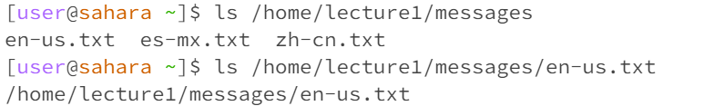
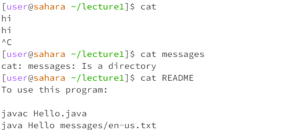

# Lab Report 1 - Remote Access and Filesystem
Welcome to my blog! In this section, we will discuss how filesystem commands work.

**cd Command**
The cd command is used to change the directory of the terminal.

  

As shown in the image, using the cd command without arguments will change the current directory to the home directory. When in the home directory and cd is called with no arguments it doesn't do anything because the current directory is the home directory. When in the lecture1 or messages directory and cd is called without commands, it will change back to the home directory. Starting from the home directory, when the cd command is called on a directory such as lecture1, the current directory is changed to the called directory (lecture1). An error occurs when cd is called on a file as it will not do anything because cd only works moving between directories.

**ls Command**
The ls command is used to list files and subdirectories in the current directory.

 

As shown in the image (in lecture1 directory) when the ls command is used without arguments, it lists all the files and subdirectories in the current directory. When ls is called on a directory such as messages, it lists all the files and subdirectories of that called directory. When ls is called on a file in its relative path, it will just show the file name.

However, when ls is called on a file in its absolute path, it will show the full path from the starting directory to the file name.

There are no errors in the ls command. Calling ls on a file will not show the content of the file because the ls command is used to show the content of directories not the content of files.

**cat Command**
The cat command is used to view files and give the content of the file.

As shown in the image, the current directory is lecture1 and when the cat command is called with no arguments it is infinitely waiting for a file name. As it waits for user input, if you type in the terminal it will display what is inputted. To get out of the infinite loop, the user can use the CTRL C command. An error occurs when cat is called on a directory, the output will show that we are in a directory and are still waiting for a file to be called because cat only works with files. When cat is called on a file README, it will show the output of the content within the README file.

