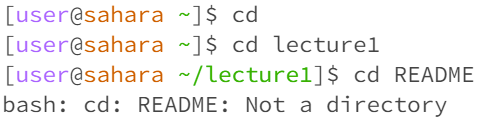

# Lab Report 1 - Remote Access and Filesystem
Welcome to my blog! In this section, we will discuss how filesystem commands work.

**cd Command**
The cd command is used to change the directory of the terminal.

  

In this scenario, with no arguments cd would not do anything unless a directory is called. When called on the directory of lecture 1, the directory is changed to lecture 1. An error occurs when cd is called on a file, it will not do anything because cd only works moving between directories.

**ls Command**
The ls command is used to list files in the directory it is in.

.png) 

In this scenario, we are in the directory of lecture1. When ls is called without arguments, it lists all the files in the lecture1 directory. When ls is called on a directory, in this case, messages, it lists all the files that are in the messages directory. When called on a file, it lists the file name.

**cat Command**
The cat command is used to view files and give the content of the file.

.png)

In this scenario, we are in the lecture1 directory and when the cat command is called with no arguments it is infinitely waiting for a file name so it does not do anything with no arguments. An error occurs when cat is called on a directory, the output will show that we are in a directory and are still waiting for a file to be called because cat only works with files. When cat is called on a file README, it will show the output of the content within the README file.

